# Workflow: Build, Verify, and Deploy

Standard pipeline for delivering a change from a commit to production. GitOps-only path; no manual `kubectl` in prod.

## Branching model

- `main` — protected, always green, deployable.
- Feature branches: `feat/<scope>-<short-name>` → PR to `main`.
- Release branches per environment if needed: `release/staging`, `release/production`.

## Pipeline stages

```mermaid
flowchart LR
    A[Pull Request]:::stage --> B[Static Checks]:::stage
    B --> C[Build]:::stage
    C --> D[Unit Tests]:::stage
    D --> E[Integration Tests]:::stage
    E --> F[Security Scans]:::stage
    F --> G[Container Build & Sign]:::stage
    G --> H[Helm Chart Lint]:::stage
    H --> I[Merge to main]:::stage
    I --> J[Argo CD: Staging Sync]:::stage
    J --> K[Smoke + E2E in Staging]:::stage
    K --> L[Promote PR to Production Branch]:::stage
    L --> M[Argo CD: Production Sync]:::stage
    M --> N[Post-Deploy Verification]:::stage
```

## Stage details

### 1. Static checks

- `dotnet format --verify-no-changes`
- `dotnet build -c Release /p:TreatWarningsAsErrors=true`
- `dotnet test --filter "Category=Unit" --no-build`
- Roslyn analyzers + StyleCop pass.
- `gitleaks detect` (secret scanning).
- `buf lint` / `protolint` for `.proto` files.
- `buf breaking` against `main` for `.proto` files.

### 2. Build

- `dotnet pack` for shared contract NuGet packages (semver from Git tag).
- `dotnet publish -c Release -o ./publish/<host>` for each host (Api, Grpc, Worker).

### 3. Tests

- **Unit:** xUnit + NSubstitute, fast (< 30 seconds total).
- **Integration:** Testcontainers MSSQL + Redis; full SP migration; minimal Linkerd-mocked client where applicable.
- **Contract:** Reqnroll features.

### 4. Security scans

- `dotnet list package --vulnerable` — fails on `High`/`Critical`.
- Snyk / GitHub Advanced Security scan.
- SBOM generated and uploaded.
- License scan.

### 5. Container build & sign

- `docker build` using multi-stage `Dockerfile`; base = `mcr.microsoft.com/dotnet/aspnet:10.0-azurelinux3.0`.
- `trivy image --severity HIGH,CRITICAL --exit-code 1`.
- `cosign sign` with key from Vault.
- Push to private registry with **immutable tags** (semver + git SHA).

### 6. Helm chart lint + render

- `helm lint`.
- `helm template` against staging values + `kubeconform` to validate against cluster CRDs.
- `kyverno cli test` against policy bundle.

### 7. Merge → Argo CD staging sync

- Argo CD watches the GitOps repo's `environments/staging/` folder.
- On merge, it syncs the updated Helm release.
- Sync strategy: **automated, pruning enabled, self-healing enabled**.

### 8. Staging verification

- Smoke tests hit `/health/ready`.
- E2E test pack (subset of integration tests) runs against the staging cluster.
- Manual verification window for the on-call engineer.

### 9. Promote to production

- PR copies the staging tag into `environments/production/<service>/values.yaml`.
- At least 1 reviewer + green checks.
- Merge triggers Argo CD production sync.

### 10. Production sync strategy

- Rolling update with `maxSurge: 25%`, `maxUnavailable: 0`.
- `PodDisruptionBudget` ensures min replicas during the roll.
- Linkerd traffic split optional for canary (10% → 50% → 100%) with automatic rollback on golden-signal regression.

### 11. Post-deploy verification

- Watch Grafana dashboards: error rate, latency p95, request rate.
- Watch alert state (Alertmanager).
- Check outbox publication lag.
- Mark the change as **stable** in the release log after the soak period (1 hour standard, 24 hours for critical services).

## Rollback strategy

- Argo CD revert to previous sync (one-click).
- Helm rollback via `helm rollback <release> <previous-revision>` only as a break-glass measure (still must be committed back to Git after).
- Database migrations are **forward-only**; never roll back schema. Forward-compatible scripts only.

## Hot fixes

- Allowed only via `hotfix/<scope>` branch off the production tag.
- Cherry-picked back to `main` immediately after deploy.
- Subject to the same security and test gates.

## Build artifacts retained

- NuGet packages (90 days).
- Container images (1 year for the latest 3 minor versions; older pruned).
- SBOMs (1 year).
- Sign-verification logs (audit).

## Required environment variables for CI

| Variable | Source |
|---|---|
| `VAULT_ADDR`, `VAULT_ROLE_ID`, `VAULT_SECRET_ID` | CI-only Approle (TTL ≤ 1h) |
| `REGISTRY_URL`, `REGISTRY_USERNAME`, `REGISTRY_PASSWORD` | Vault |
| `COSIGN_KEY_REF` | Vault |
| `OTLP_ENDPOINT` (test) | Cluster |

## Failure handling

- Any failed stage aborts the pipeline.
- Test failures: tagged in the PR; cannot merge.
- Security scan failures: cannot merge; remediate dependency or container image.
- Deployment failures in Argo CD: alert on-call; revert to last stable.

## Related

- [`new-microservice-workflow.md`](./new-microservice-workflow.md)
- [`../checklists/deployment-checklist.md`](../checklists/deployment-checklist.md)
- [`../checklists/security-checklist.md`](../checklists/security-checklist.md)
- [`../skills/kubernetes.md`](../skills/kubernetes.md)
- [`../constraints/security-enforcement.md`](../constraints/security-enforcement.md)
