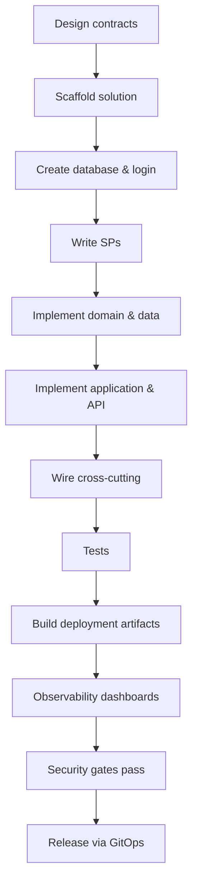

# Workflow: Add a New Microservice

End-to-end procedure for introducing a new microservice to the platform. Follow every step.

## Inputs required from product owner

- Bounded context name (e.g., `Inventory`).
- One-sentence purpose.
- External REST endpoints (resource + verbs).
- Internal gRPC operations consumed and exposed.
- Async events produced and consumed.
- Data ownership: list of aggregates owned exclusively by this service.

## Steps

### 1. Plan the contracts

1. Draft the **REST API** outline in `<service>.openapi.yaml` (audience: external clients).
2. Draft the **gRPC `.proto`** in `protos/<aggregate>.proto` (audience: sibling services).
3. List **events produced** with versioned stream names: `<aggregate>.<event>.v1`.
4. List **events consumed** (which sibling owns them).
5. Submit a design PR for review **before** writing code. CI lints `.proto` for breaking changes.

### 2. Scaffold the solution

```
dotnet new sln -n itOrchestra.Inventory
dotnet new webapi  -n itOrchestra.Inventory.Api          -f net10.0
dotnet new grpc    -n itOrchestra.Inventory.Grpc         -f net10.0
dotnet new worker  -n itOrchestra.Inventory.Worker       -f net10.0
dotnet new classlib -n itOrchestra.Inventory.Application -f net10.0
dotnet new classlib -n itOrchestra.Inventory.Domain      -f net10.0
dotnet new classlib -n itOrchestra.Inventory.Data        -f net10.0
dotnet new classlib -n itOrchestra.Inventory.Contracts   -f net10.0
dotnet new classlib -n itOrchestra.Inventory.Contracts.V1.Grpc -f net10.0
dotnet new classlib -n itOrchestra.Inventory.Infrastructure    -f net10.0
dotnet new xunit    -n itOrchestra.Inventory.UnitTests         -f net10.0
dotnet new xunit    -n itOrchestra.Inventory.IntegrationTests  -f net10.0
```

Apply the layout from [`../patterns/microservice-template.md`](../patterns/microservice-template.md). Reference dependencies match the responsibility table.

### 3. Create the database

1. Provision a dedicated database: `Inventory`.
2. Create a dedicated MSSQL login: `inventory_app` with **`GRANT EXEC`** on procedures only.
3. Add schemas: `dbo`, `audit`, `outbox`, `hangfire`.
4. Run baseline migrations to create:
   - Aggregate tables (`dbo.*`).
   - `outbox.OutboxEvents` and its SPs.
   - `audit.*` and audit triggers.
   - Tenant security policy (RLS) if applicable.

### 4. Write SQL first (TDD-friendly for DB)

For each command/query, write the SP **before** the C# handler. Test SPs with `sqlcmd` / SSMS.

- Commands: `sp_<Module>_<Verb>_<Entity>` (e.g., `sp_Inventory_Reserve_Stock`).
- Queries: same naming but for read shapes.
- Wrap multi-statement writes in `SET XACT_ABORT ON` + `TRY/CATCH` + `ROLLBACK`/`THROW`.

### 5. Implement in C#

Order of work:

1. **Domain** types (records, `Result<T>`, errors).
2. **Data** repositories that call the SPs.
3. **Application** MediatR commands/queries + handlers.
4. **Contracts** REST DTOs and event envelopes.
5. **Contracts.V1.Grpc** `.proto` + `Grpc.Tools`.
6. **Api** controllers + thin endpoints.
7. **Grpc** gRPC service classes.
8. **Worker** Hangfire jobs + stream consumers.
9. **Infrastructure** telemetry/Vault/Polly extensions.

### 6. Wire cross-cutting

- Vault Agent annotations for: connection string, Redis, Keycloak client secret, OTLP endpoint.
- Keycloak realm: register `inventory-api` client; create roles `inventory.read`, `inventory.write`.
- YARP route: add `/api/v1/inventory/**` route in the gateway's config.
- Linkerd: `Server` + `ServerAuthorization` resources allowing meshed consumer service accounts.
- OpenTelemetry source name `itOrchestra.Inventory`.
- Hangfire schema configured against the service's own DB.

### 7. Tests

- **Unit:** every handler tested in isolation with NSubstitute mocks.
- **Integration:** Testcontainers MSSQL + Redis; spin up the API host; assert end-to-end SP execution.
- **Contract:** Reqnroll features describing user-facing flows; one per command.
- **gRPC:** in-memory test server; assert error codes.
- **Outbox:** integration test verifies row insert + drain + Redis Stream entry.

### 8. Deployment artifacts

- `Dockerfile` per host project (API, Grpc, Worker). Base image: `mcr.microsoft.com/dotnet/aspnet:10.0-azurelinux3.0`. Runs as `nonroot` UID.
- `helm/itorchestra-inventory/`:
  - Chart.yaml
  - values.yaml (resources, replicas, autoscaling, Vault role)
  - templates/ (Namespace, Deployment × 3, Service × 2, HPA × 3, PDB × 3, ServiceAccount × 3, NetworkPolicy, Linkerd policies)
- Argo CD `Application` pointing at the chart.
- Image signed with Cosign in CI.

### 9. Observability

- Grafana dashboard for `inventory-api` and `inventory-worker` (golden signals + business metrics).
- Alerts: error rate > 1%, p95 latency > SLO, outbox lag > N events.
- Log queries pre-baked: failed reservations, retries, dead-lettered events.

### 10. Security & compliance

- Run `dotnet list package --vulnerable` — must pass.
- Trivy scan on images — must pass.
- Cosign signature attached.
- Keycloak roles created and assigned to relevant groups.
- Vault role + policy reviewed.
- NetworkPolicy + Linkerd authorization reviewed.

### 11. Release

- Tag `inventory-v1.0.0`.
- Argo CD syncs to staging; run smoke tests.
- Promote to production via PR to the prod environment branch.
- Monitor Grafana dashboards and alerts for the first 24 hours.

## Mermaid: the workflow



## Acceptance gates

A new service is **not** considered ready until:

- All checklists in [`../checklists/deployment-checklist.md`](../checklists/deployment-checklist.md) and [`../checklists/security-checklist.md`](../checklists/security-checklist.md) pass.
- Integration tests green.
- Argo CD shows healthy + in-sync in staging for 24 hours.
- On-call runbook exists.

## Related

- [`../patterns/microservice-template.md`](../patterns/microservice-template.md)
- [`../patterns/api-template.md`](../patterns/api-template.md)
- [`deployment-workflow.md`](./deployment-workflow.md)
- [`../checklists/deployment-checklist.md`](../checklists/deployment-checklist.md)
- [`../checklists/security-checklist.md`](../checklists/security-checklist.md)
